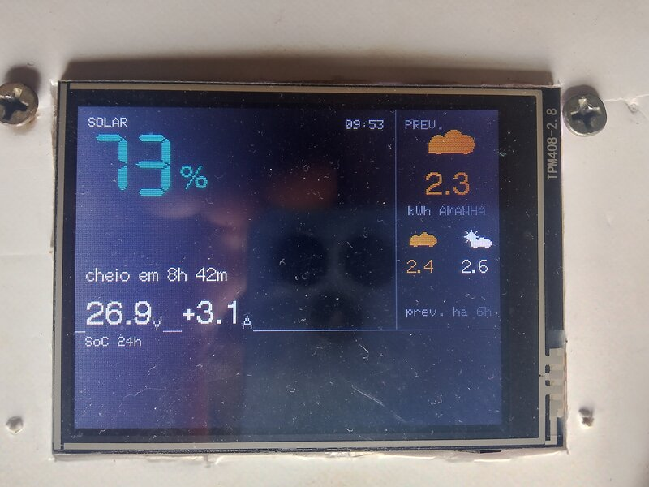

# felicity-cyd

**An off-grid solar dashboard on a $12 display.** Battery state of charge read
straight off the inverter's WiFi dongle over LAN, plus a 3-day *generation*
forecast — so you know tonight whether you can keep working past midnight.



No app. No cloud account. No touch. One screen you read from across the room.

---

## Why

Living off-grid, the question is never "what's the weather tomorrow". It's
**"can I stay up late on the computer tonight?"**

The vendor app answers half of that: it shows the battery, and only when your
phone is on the same WiFi and the app feels like connecting. It says nothing
about whether tomorrow will refill the pack.

So this screen answers both, and it answers them without me touching anything:

- **Now** — state of charge, volts, amps, time to full/empty.
- **Last 24 h** — a SoC sparkline, so you can see whether you're trending down.
- **Next 3 days** — estimated kWh the panels will actually produce, colour-coded
  good / ok / bad.

The forecast is the part that changes behaviour. `2.3 kWh` in orange means
*tomorrow won't refill the pack — turn things off tonight.*

## What's on screen

| | |
|---|---|
| `73%` big, colour-coded | State of charge. Red below 50%, yellow to 70%, green above. |
| `cheio em 8h 42m` | Time to full (or `vazio em` — time to empty — when discharging). |
| `26.9V  +3.1A` | Pack voltage and signed current. Positive = charging. |
| Right column | Tomorrow's estimated generation in kWh, large; then the two days after, small. Each coloured by its own level. |
| `prev. há 6h` | Age of the forecast. If it goes stale, the column degrades instead of lying. |
| Bottom strip | SoC over the last 24 h. |

Colour means one thing only: **is this actionable?** Red is reserved for a
genuinely critical pack — never for "the forecast is bad".

## Hardware

| Part | Notes |
|---|---|
| ESP32-2432S028R ("Cheap Yellow Display") | ILI9341, 320×240, ~US$ 10–15 |
| Felicity Solar LiFePO4 pack + WiFi dongle | The dongle is the data source. 24 V / 8S here; other packs should work. |
| USB power | 5 V, anything. It sips power — this matters when the whole house is solar. |
| A VPS (optional) | Only for the forecast. The battery half works with zero internet. |

That's it. No Raspberry Pi, no broker, no database.

## How it works

```
   ┌──────────────────┐        LAN, TCP :53970          ┌──────────┐
   │ Felicity dongle  │◄────────────────────────────────│          │
   └──────────────────┘   plain JSON, no auth, 10 s     │   CYD    │
                                                        │  ESP32   │
   ┌──────────────────┐   HTTPS GET outlook.json, 15 min│          │
   │ VPS (Go + Caddy) │◄────────────────────────────────│          │
   └────────┬─────────┘                                 └──────────┘
            │ every 4 h                                  cached in NVS
   ┌────────▼─────────┐
   │   Open-Meteo     │  hourly shortwave_radiation
   └──────────────────┘
```

**The two paths never touch each other.** That's deliberate. The battery
reading is the critical one and it depends on nothing but the LAN — no
internet, no server, no broker. The forecast is planning data; it can be hours
stale or entirely absent and the screen still does its main job.

Internet at the property is a Starlink dish that gets switched off when I go to
bed, to save power. So every layer caches the last good answer:

- The VPS keeps serving the last good `outlook.json` if Open-Meteo is down.
- The CYD keeps the last good payload in NVS, surviving reboots and blackouts.
- The forecast is keyed on **absolute dates**, never on "tomorrow". A cache that
  says `tomorrow = 2.8 kWh` starts lying the moment you go two days offline. The
  CYD resolves dates against its own clock and visibly degrades when the cache
  no longer covers today.

## Quick start

```sh
git clone https://github.com/marcosvpj/felicity-cyd
cd felicity-cyd/CYD
cp include/secrets.h.example include/secrets.h   # WiFi, dongle IP, forecast URL, pack Ah, UTC offset
make upload
```

Find the dongle's IP in your router's DHCP table, then sanity-check the API
before flashing anything:

```sh
printf 'wifilocalMonitor:get dev real infor' | nc <dongle-ip> 53970
```

If that returns JSON, you're in business. Full firmware notes in
[`CYD/README.md`](CYD/README.md); the forecast service in
[`API/README.md`](API/README.md).

**The forecast half is optional.** Skip it and you still get a working battery
monitor — it just shows the degraded forecast state. If you do want it, the
service is ~300 lines of Go and runs off a systemd timer; you'll need to point
`SECRET_OUTLOOK_URL` at your own host and set your own coordinates.

## Is this for you?

**Probably yes if:** you have a Felicity pack with the WiFi dongle, you're
off-grid or hybrid, and you want a physical screen instead of an app.

**Probably no if:** you want alerts, history beyond 24 h, remote access, or a
turnkey product. This is a screen on a wall. It does one thing.

**Other inverters:** the protocol client is one file
(`CYD/src/felicity.{h,cpp}`) with a struct-shaped output. Swapping in Modbus or
another vendor's API means rewriting that file and nothing else.

## Status

Working and installed. Battery telemetry, 24 h sparkline and 3-day forecast all
render from live data. The protocol was reverse-engineered by watching traffic —
several fields are still undecoded (`Estate`, `Bfault`, `Bwarn` bitmasks). The
full protocol is written up in [`docs/PROTOCOL.md`](docs/PROTOCOL.md) — useful
on its own if you have a Felicity pack and no interest in this display.

Contributions welcome, especially from anyone with a different Felicity model
who can tell me where the payload differs.

## License

MIT — see [`LICENSE`](LICENSE).

---

Built at ~900 m in Alfredo Wagner, Santa Catarina, Brazil, where the electricity
comes off the roof and the forecast decides what runs tonight.
